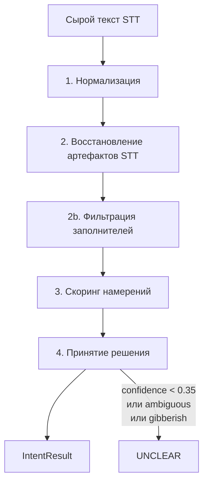

# MedZvon — пайплайн классификации намерений

## Общая схема



## Этапы

### 1. Нормализация (`normalize.js`)

| Вход | Действие | Выход |
|------|----------|-------|
| `«Скажите, СКОЛЬКО стоит приём?!»` | lowercase, удаление пунктуации, удаление фраз-заполнителей | `['скажите', 'сколько', 'стоит', 'приём']` |

### 2. Восстановление артефактов STT (`repairStt.js`)

| Тип | Пример | Результат |
|-----|--------|-----------|
| Склейка разрыва | `за` + `писаться` | `записаться` |
| Homophone + контекст | `принести` + `запись` + `вместо` | `перенести` |

### 2b. Фильтрация заполнителей (`filterStopWords.js`)

Удаляются слова вроде «ну», «наверное», «мне», но сохраняются служебные слова, нужные для phrase-matching (`не`, `с`, `за`).

### 3. Скоринг (`scoreIntents.js`)

Для каждого намерения суммируются веса совпавших ключевых слов и фраз. Fuzzy match (Levenshtein ≤ 2) даёт 70% веса.

### 4. Принятие решения (`decide.js`)

| Условие | Результат |
|---------|-----------|
| Пустой ввод | UNCLEAR |
| >50% шумовых/неизвестных токенов | UNCLEAR |
| Только прощание без сигналов | UNCLEAR |
| confidence < 0.35 | UNCLEAR |
| top-1 и top-2 близки (< 15%) | UNCLEAR |
| Иначе | intent с max score |

## Пример: фраза №9 из брифа

**Вход:** `принести запись на среду вместо четверга`

| Этап | Токены / решение |
|------|------------------|
| Нормализация | `['принести', 'запись', 'на', 'среду', 'вместо', 'четверга']` |
| Repair | `принести` → `перенести` (контекст: запись, вместо, среда) |
| Скоринг | RESCHEDULE: `перенести`(1.0) + `запись`(0.4) + `вместо`(0.8) + phrase bonuses |
| Решение | **RESCHEDULE**, confidence ≈ 0.85 |

## Запуск

```bash
npm install
npm test
npm run cli -- "хочу записаться к врачу"
```
