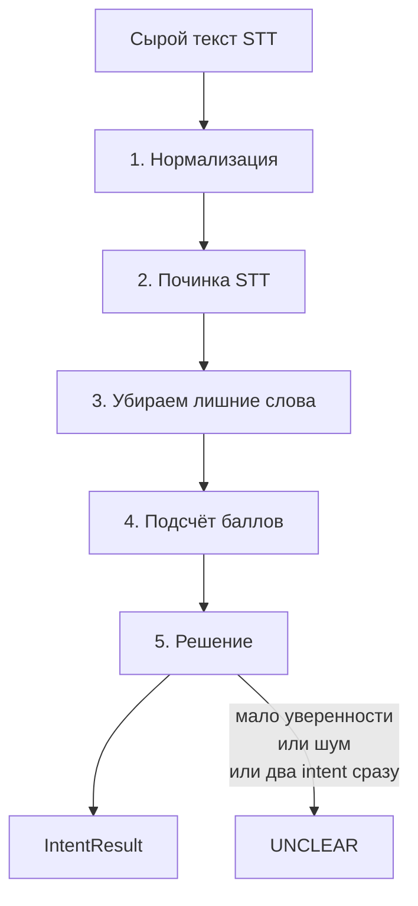

# MedZvon - как текст превращается в намерение

## Общая схема



## Шаги по порядку

### 1. Нормализация (`normalize.js`)

| Было | Что делаем | Стало |
|------|------------|-------|
| `«Скажите, СКОЛЬКО стоит приём?!»` | нижний регистр, убираем знаки, режем на слова | `['скажите', 'сколько', 'стоит', 'приём']` |

### 2. Починка STT (`repairStt.js`)

| Что ломает STT | Пример | После починки |
|----------------|--------|---------------|
| Разорванное слово | `за` + `писаться` | `записаться` |
| Похожие по звучанию | `принести` + `запись` + `вместо` | `перенести` |

### 3. Убираем слова-паразиты (`filterStopWords.js`)

Удаляем «ну», «наверное», «мне». Оставляем «не», «с», «за» - они нужны для распознавания фраз вроде «не с роботом».

### 4. Подсчёт баллов (`scoreIntents.js`)

Для каждого намерения (BOOK, CANCEL и т.д.) смотрим совпадения по словам и фразам из словаря. Похожие слова (до 2 опечаток) дают 70% веса.

### 5. Решение (`decide.js`)

| Ситуация | Ответ |
|----------|-------|
| Пустая строка | UNCLEAR |
| Больше половины слов - шум | UNCLEAR |
| Только «спасибо, до свидания» | UNCLEAR |
| Уверенность ниже 0.35 | UNCLEAR |
| Два намерения почти поровну | UNCLEAR |
| Всё ясно | намерение с max баллом |

## Пример из брифа (фраза №9)

**Вход:** `принести запись на среду вместо четверга`

| Шаг | Что получилось |
|-----|----------------|
| Нормализация | `['принести', 'запись', 'на', 'среду', 'вместо', 'четверга']` |
| Починка | `принести` → `перенести` (рядом есть «запись», «вместо», день недели) |
| Баллы | RESCHEDULE: перенести + запись + вместо + бонус за фразы |
| Итог | **RESCHEDULE**, уверенность ≈ 0.85 |

## Как проверить

```bash
npm install
npm test
npm run cli -- "хочу записаться к врачу"
```
